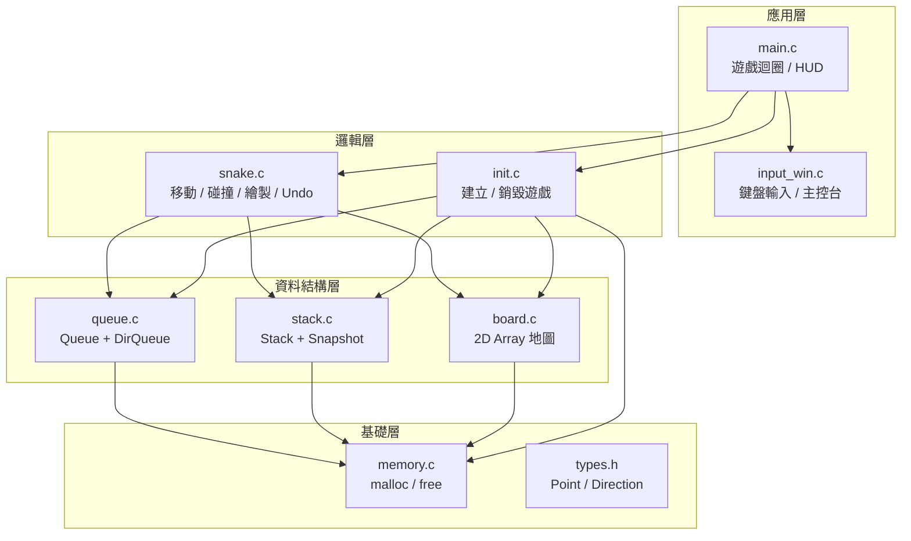
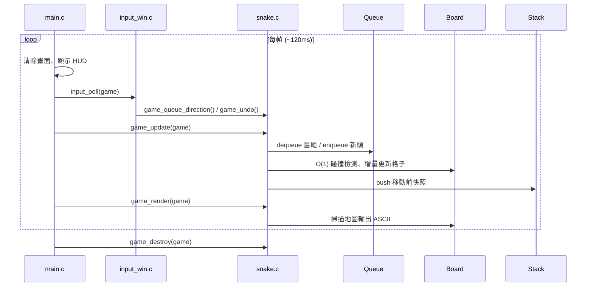

# 專題名稱：C 語言貪食蛇遊戲 Final

> **C Snake Game Final** — 強化完整版（音效、關卡編輯器、四段速度、GitHub Pages 網頁版）

> 本專案為獨立 Repository **`snake-game-final`**，不會覆蓋舊版 [`snake-game`](https://github.com/singpraise/snake-game)。

| 項目 | 內容 |
|------|------|
| 開發語言 | C（C99） |
| 執行平台 | Windows 終端機 / **瀏覽器（WebAssembly）** |
| 編譯器 | GCC（MSYS2 UCRT64）/ MSVC / Emscripten |
| 專案類型 | 終端機遊戲（TUI）+ 網頁版（WASM） |

### 線上試玩（GitHub Pages）

| 項目 | 連結 |
|------|------|
| **GitHub Repository** | [github.com/singpraise/snake-game-final](https://github.com/singpraise/snake-game-final) |
| **線上遊戲（部署後）** | [singpraise.github.io/snake-game-final](https://singpraise.github.io/snake-game-final/) |
| **舊版（保留）** | [github.com/singpraise/snake-game](https://github.com/singpraise/snake-game) |

> 網頁版使用**同一份 C 原始碼**（`snake.c`、`queue.c`、`stack.c`、`board.c` 等），僅平台層不同。

---

## 目錄

1. [功能介紹](#1-功能介紹)
2. [使用技術](#2-使用技術)
3. [系統架構](#3-系統架構)
4. [程式碼結構](#4-程式碼結構)
5. [How to Run — 執行方式](#5-how-to-run--執行方式)
6. [網頁版與 GitHub Pages 部署](#6-網頁版與-github-pages-部署)
7. [操作說明](#7-操作說明)
8. [編譯與建置](#8-編譯與建置)
9. [常見問題](#9-常見問題)
10. [遊戲參數](#10-遊戲參數)

---

## 1. 功能介紹

### 1.1 專題簡介

本專題以 **C 語言**從零實作一款可在 Windows 終端機執行的貪食蛇遊戲。核心目標不只是完成遊戲玩法，更著重於：

- 以 **指標（Pointer）** 串接動態資料結構
- 以 **`malloc` / `free`** 管理所有 heap 記憶體
- 實作並應用 **Queue、Stack、2D Array** 三種資料結構
- 模組化拆分程式碼，維持清晰的職責分離

### 1.2 主要功能

| 功能 | 說明 |
|------|------|
| 蛇身移動 | 以 Queue 管理蛇身，每幀 enqueue 新頭、dequeue 舊尾 |
| 碰撞偵測 | 以 2D Array 地圖 O(1) 查詢牆壁、自身、食物 |
| 食物生成 | 隨機產生食物，吃到後分數 +10、身體變長 |
| 方向輸入緩衝 | DirQueue 暫存玩家連續按鍵，避免輸入遺失 |
| 悔棋（Undo） | Stack 儲存移動前快照，按 `U` 可還原（最多 50 步） |
| Game Over | 撞牆或撞到自己時結束，顯示最終分數 |
| 記憶體安全 | 統一 `mem_malloc` / `SAFE_FREE`，支援 `MEM_DEBUG` 洩漏檢查 |

### 1.3 強化版（Enhanced Mode）— 新增

啟動時選擇 **Enhanced**，或在網頁版切換模式：

| 強化功能 | 說明 |
|----------|------|
| 障礙物 `#` | 地圖上隨機障礙，撞到即 Game Over |
| 關卡升級 | 每吃 3 個食物升一級，速度加快 |
| 獎勵食物 `$` | 20% 機率出現，+30 分（一般食物 +10） |
| 速度四段 | **簡單 / 中間 / 更難 / 最難**（Classic 與 Enhanced 皆可選） |
| 暫停 `P` | 隨時暫停與繼續 |
| 最高分 | Windows 存檔 / 瀏覽器 localStorage |

**Classic** 模式維持原版玩法，不含障礙物與關卡。

### 1.4 音效系統（新增）

| 事件 | 音效 |
|------|------|
| 吃食物 `*` | 短促高音 |
| 吃獎勵 `$` | 雙音上升 |
| 升級 | 三音階 |
| Game Over | 低音下降 |
| Undo / 暫停 | 短音提示 |
| 編輯器放置 / 存檔 | 操作音 |

- Windows：系統 `Beep()`
- 網頁：Web Audio API
- 按 **`M`** 或網頁 **Sound** 按鈕靜音

### 1.5 關卡編輯器（新增）

主選單選 **`[3] Level Editor`**，或在網頁按 **Level Editor**。

| 按鍵 | 功能 |
|------|------|
| `1-5` | 選工具：擦除 / 障礙 / 食物 / 獎勵 / 蛇頭 |
| `W` `X` `A` `D` / 方向鍵 | 移動游標 `+` |
| `Space` | 放置圖塊 |
| `H` | 切換蛇的初始方向 |
| `S` | 存檔至 `levels/last.lvl` |
| `L` | 讀取 `levels/example.lvl` |
| `T` | 測試遊玩自訂關卡 |
| `Q` | 離開編輯器 |

關卡檔格式（文字檔 `.lvl`）見 `levels/example.lvl`。

### 1.3 遊戲畫面預覽

```
=== C Snake Game (Windows) [EN] ===
Score: 10 | Length: 4 | Dir: DOWN | Food: (13,4)
Controls: WASD / Arrow keys | U Undo | Q Quit

....................
....................
.........@oo........
.........*..........
....................
```

| 符號 | 意義 |
|------|------|
| `@` | 蛇頭 |
| `o` | 蛇身 |
| `*` | 食物 |
| `.` | 空地 |

---

## 2. 使用技術

### 2.1 指標（Pointer）

本專案大量使用指標作為資料結構的串接與傳遞媒介：

| 應用場景 | 說明 | 程式位置 |
|----------|------|----------|
| 鏈結式節點 | `QueueNode *next`、`StackNode *next` 串接佇列與堆疊 | `queue.h`, `stack.h` |
| 二維陣列 | `Cell **cells` 指向列指標陣列，每列再指向 `Cell` 陣列 | `board.h` |
| 遊戲狀態傳遞 | `GameState *game` 在各模組間傳遞，避免大型結構複製 | `snake.h`, `main.c` |
| 輸出參數 | `queue_dequeue(Queue *q, Point *out)` 透過指標回傳結果 | `queue.c` |
| 指標歸零 | `SAFE_FREE` 釋放後將指標設為 `NULL`，防止懸空指標 | `memory.h` |

**範例：Queue 節點以指標串接**

```c
typedef struct QueueNode {
    Point data;
    struct QueueNode *next;  /* 指向下一个節點 */
} QueueNode;

typedef struct {
    QueueNode *front;  /* 指向蛇尾 */
    QueueNode *rear;   /* 指向蛇頭 */
    int size;
} Queue;
```

### 2.2 動態記憶體（Malloc / Free）

所有 heap 配置統一經由 `memory.c` 管理，**禁止**在其他檔案直接呼叫 `malloc` / `free`：

```c
void *mem_malloc(size_t size);
void *mem_calloc(size_t count, size_t size);
void  mem_free(void *ptr);

#define SAFE_FREE(ptr)        \
    do {                      \
        mem_free(ptr);        \
        (ptr) = NULL;         \
    } while (0)
```

**黃金法則：有多少 `malloc` / `calloc`，就必須有多少 `free`。**

| 配置來源 | 釋放方式 |
|----------|----------|
| `mem_malloc(Queue)` | `queue_destroy()` → `SAFE_FREE` |
| `mem_malloc(QueueNode)` | `queue_dequeue()` → `SAFE_FREE` |
| `mem_malloc(Board)` + `Cell**` + 各列 `Cell*` | `board_destroy()` |
| `mem_malloc(Stack)` + `StackNode` | `stack_destroy()` / `stack_pop()` |
| `mem_calloc(GameState)` | `game_destroy()` |

初始化失敗時，`init.c` 使用 `goto fail` 集中清理已配置的資源，避免 partial allocation 造成記憶體洩漏。

編譯時加上 `-DMEM_DEBUG` 可啟用配置計數，程式結束時 `mem_assert_clean()` 應回傳 0。

### 2.3 資料結構（Data Structures）

本專題實作並應用三種資料結構，各自對應不同的遊戲需求：

#### Queue（先進先出 FIFO）— 蛇身與方向輸入

```
enqueue →  [尾|o|o|o|@|head]  ← rear（蛇頭）
dequeue ←  front（蛇尾）
```

- **`Queue body`**：蛇身座標佇列。移動時在 `rear` 加入新頭、從 `front` 移除舊尾
- **`DirQueue input`**：方向輸入緩衝。玩家快速連按時，每幀依序取出一個方向

| 操作 | 時間複雜度 | 函式 |
|------|-----------|------|
| enqueue | O(1) | `queue_enqueue()` |
| dequeue | O(1) | `queue_dequeue()` |
| peek 頭/尾 | O(1) | `queue_peek_rear()` |

#### Stack（後進先出 LIFO）— 悔棋快照

```
push →  [最新快照] → [較舊] → [最舊]
         ↑ top
pop  ←  還原上一步
```

- 每次移動前 `stack_push()` 一份 `MoveSnapshot`（含蛇身、地圖、分數、方向）
- 按 `U` 時 `stack_pop()` 還原，`UNDO_STACK_MAX = 50` 限制深度

#### 2D Array（二維陣列）— 遊戲地圖

```c
typedef struct {
    int width, height;
    Cell **cells;   /* cells[y][x] */
} Board;
```

- 每格儲存 `CELL_EMPTY` / `CELL_SNAKE` / `CELL_SNAKE_HEAD` / `CELL_FOOD`
- 碰撞檢測與繪製查詢皆為 **O(1)**，不需遍歷蛇身 Queue

#### 結構體（Struct）— 遊戲狀態整合

```c
typedef struct {
    int width, height;
    Queue    *body;       /* 蛇身 */
    Board    *board;      /* 地圖 */
    DirQueue *input;      /* 方向輸入 */
    Stack    *undo_stack; /* 悔棋 */
    int length, score, game_over;
    Direction dir, next_dir;
    Point food;
} GameState;
```

---

## 3. 系統架構

### 3.1 模組分層



### 3.2 遊戲主迴圈



### 3.3 `game_update()` 一幀流程

```
玩家輸入 (DirQueue)
       ↓
方向合法性檢查（不可直接反向）
       ↓
計算新蛇頭座標
       ↓
Board O(1) 碰撞檢測 ──→ 撞牆/撞身 → game_over
       ↓
stack_push 快照（供 Undo）
       ↓
queue_enqueue 新頭
       ↓
吃到食物？ ──否──→ queue_dequeue 舊尾
       ↓是
分數 +10、重新生成食物
       ↓
Board 增量更新格子狀態
```

---

## 4. 程式碼結構

專案採 **一個模組一對 `.h` / `.c` 檔** 的設計，標頭檔負責型別與介面宣告，實作檔負責邏輯，職責清楚、易於閱讀與維護。

```
snake/
│
├── types.h                  共用基本型別（Point, Direction）
├── memory.h / memory.c      統一動態記憶體配置與釋放
├── queue.h / queue.c        鏈結式 Queue（蛇身）+ DirQueue（方向輸入）
├── stack.h / stack.c        鏈結式 Stack（Undo 快照）
├── board.h / board.c        2D Array 地圖（碰撞 / 繪製）
├── snake.h / snake.c        遊戲核心邏輯（移動、食物、渲染、Undo）
├── init.h / init.c          遊戲初始化與銷毀（pointer + malloc）
├── game_ui.h / game_ui.c    HUD 與 Game Over 畫面（原生 / 網頁共用）
├── platform.h               平台層介面（輸入、畫面、延遲）
│
├── main.c                   Windows 原生進入點
├── input_win.c              Windows 平台實作
├── main_web.c               瀏覽器進入點（Emscripten）
├── platform_web.c           瀏覽器平台實作
│
├── web/                     網頁版前端（index.html, style.css, snake.wasm）
├── build.bat / build.sh     Windows 原生建置
├── build_web.sh / build_web.bat   網頁版建置（Emscripten）
├── .github/workflows/       GitHub Actions 自動部署 Pages
│
├── README.md                專題說明文件（本文件）
└── INSTALL.txt              編譯器安裝詳細指南
```

### 模組職責對照

| 模組 | 職責 | 關鍵函式 |
|------|------|----------|
| `main.c` | 遊戲迴圈、HUD、Game Over 畫面 | `main()` |
| `init.c` | 以 malloc 建立所有資料結構 | `game_create()`, `game_destroy()` |
| `snake.c` | 移動、碰撞、食物、繪製、Undo | `game_update()`, `game_render()`, `game_undo()` |
| `queue.c` | FIFO 佇列操作 | `queue_enqueue()`, `queue_dequeue()` |
| `stack.c` | LIFO 堆疊操作 | `stack_push()`, `stack_pop()` |
| `board.c` | 2D 地圖讀寫 | `board_get()`, `board_set()`, `board_rebuild()` |
| `memory.c` | heap 配置追蹤 | `mem_malloc()`, `SAFE_FREE` |
| `input_win.c` | 非阻塞鍵盤讀取 | `input_poll()`, `platform_console_init()` |

### 程式碼品質要點

- **模組化**：每個資料結構獨立成檔，介面與實作分離
- **一致性**：命名遵循 `模組_動作` 慣例（如 `queue_enqueue`、`board_set`）
- **錯誤處理**：malloc 失敗回傳 `NULL` 或 `-1`，上層統一清理
- **註解**：標頭檔說明各結構的遊戲角色與操作語意
- **編碼**：原始碼 UTF-8（無 BOM），UI 為英文 ASCII

---

## 5. How to Run — 執行方式

### 5.1 已有執行檔（最快）

```powershell
# PowerShell — 先切到專案目錄
cd "C:\Users\Lenovo\Documents\C_Joyce Wan\snake"
.\snake.exe
```

```bash
# Git Bash
cd "/c/Users/Lenovo/Documents/C_Joyce Wan/snake"
./snake.exe
```

或直接雙擊 **`run.bat`**。

### 5.2 從原始碼編譯後執行

```powershell
cd "C:\Users\Lenovo\Documents\C_Joyce Wan\snake"
.\build.bat
.\snake.exe
```

```bash
# Git Bash
cd "/c/Users/Lenovo/Documents/C_Joyce Wan/snake"
bash build.sh
./snake.exe
```

### 5.3 執行環境需求

| 項目 | 需求 |
|------|------|
| 作業系統 | Windows 10 / 11 |
| 執行檔 | `snake.exe`（無需額外安裝執行時期） |
| 編譯（僅開發者） | GCC 或 MSVC，詳見 [第 7 節](#7-編譯與建置) |
| 終端機 | PowerShell、cmd、Git Bash 或 Windows Terminal |

### 5.4 執行流程圖

```
開啟終端機
    ↓
cd 到 snake/ 資料夾          ← 必要步驟
    ↓
已有 snake.exe？
  ├─ 是 → 執行 .\snake.exe 或 ./snake.exe
  └─ 否 → 執行 build.bat / build.sh 編譯
              ↓
          執行 snake.exe
              ↓
          WASD 操作遊戲，Q 離開
```

---

## 6. 網頁版與 GitHub Pages 部署

### 6.1 雙平台架構（維持 C 語言核心）

```
                    ┌─────────────────────────────────────┐
                    │     共用核心（完全相同 C 原始碼）      │
                    │  init.c  snake.c  queue.c  stack.c  │
                    │  board.c  memory.c  game_ui.c         │
                    └─────────────────┬───────────────────┘
                                      │
              ┌───────────────────────┴───────────────────────┐
              ▼                                               ▼
    ┌─────────────────────┐                     ┌─────────────────────┐
    │   Windows 原生版     │                     │   瀏覽器 Web 版      │
    │   main.c            │                     │   main_web.c        │
    │   input_win.c       │                     │   platform_web.c    │
    │   → snake.exe       │                     │   → snake.wasm      │
    └─────────────────────┘                     └─────────────────────┘
```

| 層級 | Windows | Web |
|------|---------|-----|
| 進入點 | `main.c` | `main_web.c` |
| 平台層 | `input_win.c` | `platform_web.c` |
| UI | `game_ui.c` | `game_ui.c`（共用） |
| 遊戲邏輯 | `snake.c` 等 | `snake.c` 等（共用） |

### 6.2 一鍵部署到 GitHub Pages

1. 在 GitHub 建立 Repository，將 `snake/` 資料夾內容 push 上去
2. 到 Repository **Settings → Pages**
3. **Build and deployment → Source** 選 **GitHub Actions**
4. push 到 `main` 分支後，`.github/workflows/deploy-pages.yml` 會自動：
   - 用 Emscripten 編譯 C → WebAssembly
   - 部署 `web/` 到 GitHub Pages
5. 幾分鐘後即可用網址開啟遊戲

### 6.3 本機建置網頁版

需先安裝 [Emscripten](https://emscripten.org/docs/getting_started/downloads.html)：

```bash
# Git Bash / MSYS2
bash build_web.sh

# 本機預覽（需 HTTP server，不可直接雙擊 html）
cd web
python -m http.server 8080
# 開啟 http://localhost:8080/
```

```powershell
# PowerShell（已安裝 emcc 時）
.\build_web.bat
```

### 6.4 網頁檔案

```
web/
├── index.html    # 遊戲頁面 + GitHub 連結
├── style.css     # 樣式
├── snake.js      # Emscripten 輸出（建置後產生）
└── snake.wasm    # WebAssembly 二進位（建置後產生）
```

---

## 7. 操作說明

| 按鍵 | 功能 |
|------|------|
| `W` / `↑` | 向上移動 |
| `S` / `↓` | 向下移動 |
| `A` / `←` | 向左移動 |
| `D` / `→` | 向右移動 |
| `U` | 悔棋（Undo），最多 50 步 |
| `P` | 暫停 / 繼續 |
| `R` | 重新開始（保留目前模式） |
| `Q` | 離開遊戲 |

**規則：**
- 吃到食物（`*`）→ 分數 +10，蛇身 +1
- 撞牆或撞到自己 → Game Over
- 不能直接 180° 反向（例如向右時不能直接按左）

---

## 8. 編譯與建置

### 7.1 建置方式總覽

| 終端機 | 編譯指令 | 執行指令 |
|--------|----------|----------|
| PowerShell / cmd | `.\build.bat` | `.\snake.exe` |
| Git Bash | `bash build.sh` | `./snake.exe` |
| MSYS2 UCRT64 | `make` | `./snake.exe` |
| Visual Studio | `build_msvc.bat` | `snake.exe` |

### 7.2 手動編譯

```bash
gcc -std=c99 -Wall -Wextra -O2 \
    -finput-charset=UTF-8 -fexec-charset=UTF-8 \
    -o snake.exe \
    main.c init.c snake.c queue.c stack.c board.c memory.c input_win.c
```

### 7.3 安裝 GCC（MSYS2 UCRT64）

```bash
pacman -S mingw-w64-ucrt-x86_64-gcc
```

將 `C:\msys64\ucrt64\bin` 加入 Windows PATH，重開終端機後執行 `gcc --version` 驗證。

完整安裝步驟請見 [`INSTALL.txt`](INSTALL.txt)。

---

## 9. 常見問題

| 問題 | 原因 | 解決方式 |
|------|------|----------|
| 找不到 `snake.exe` | 不在專案目錄 | `cd` 到 `snake/` 資料夾 |
| `gcc not found` | 編譯器未安裝或未加入 PATH | 安裝 MSYS2 GCC，見 INSTALL.txt |
| Git Bash 無法跑 `.\build.bat` | `.\` 是 PowerShell 語法 | 改用 `bash build.sh` |
| 編譯靜默失敗 | `ucrt64\bin` 不在 PATH | 確認 DLL 路徑已加入 PATH |
| 畫面亂碼 | 使用舊版執行檔 | 重新 `build.bat` 編譯 |

---

## 10. 遊戲參數

| 參數 | 預設值 | 定義位置 |
|------|--------|----------|
| 地圖寬度 | 20 | `main.c` → `game_create(20, 15, 3)` |
| 地圖高度 | 15 | 同上 |
| 初始蛇長 | 3 | 同上 |
| 每幀間隔 | 120 ms | `main.c` → `GAME_TICK_MS` |
| Undo 上限 | 50 步 | `stack.h` → `UNDO_STACK_MAX` |
| 一般食物 | +10 分 | `game_config.h` |
| 獎勵食物 `$` | +30 分 | 強化版限定 |
| 升級條件 | 每 3 個食物 | `FOODS_PER_LEVEL` |

---

## 附錄：技術對照總表

| 評量項目 | 本專題實作 |
|----------|-----------|
| **Pointer** | 鏈結節點串接、二維陣列、GameState 指標傳遞、SAFE_FREE 歸零 |
| **Malloc** | 統一 `mem_malloc` / `mem_calloc`，完整 `game_destroy` 釋放鏈 |
| **資料結構** | Queue（蛇身）、Stack（Undo）、2D Array（地圖） |
| **程式碼結構** | 模組化 `.h`/`.c` 分離，標頭檔註解說明職責 |
| **README.md** | 專題介紹、技術說明、架構圖、執行指南 |
| **系統架構** | 分層模組圖 + 主迴圈時序圖 + 更新流程 |
| **How to Run** | PowerShell / Git Bash / 雙擊 run.bat / GitHub Pages 網頁 |
| **Web / WASM** | Emscripten 編譯，核心 C 原始碼不變，僅替換平台層 |
| **Flask 後端** | 路由、關卡 API、伺服器排行榜（`app.py`） |

---

## Flask 後端（Python）

### 架構

```
瀏覽器
  ├── Flask (app.py)     → 路由、Jinja2 模板、REST API
  ├── flask_api.js       → 呼叫 /api/scores、/api/levels
  └── snake.wasm (C)     → 遊戲邏輯（不變）
```

### API 路由

| 方法 | 路徑 | 功能 |
|------|------|------|
| GET | `/` | 遊戲首頁 |
| GET | `/api/health` | 健康檢查 |
| GET | `/api/levels` | 關卡列表 |
| GET | `/api/levels/<name>` | 取得關卡內容 |
| POST | `/api/levels/<name>` | 儲存關卡 |
| GET | `/api/scores` | 排行榜 |
| POST | `/api/scores` | 提交分數 |

### 啟動 Flask（本機）

```powershell
# 1. 編譯 WASM（首次）
bash build_web.sh

# 2. 安裝依賴並啟動
pip install -r requirements.txt
python app.py
# 或雙擊 run_flask.bat
```

開啟：**http://127.0.0.1:5000**

Flask 版網頁額外提供：

- **伺服器排行榜** — 分數寫入 `data/highscores.json`
- **關卡載入** — 從 `levels/*.lvl` 載入到 WASM 遊戲
- **網頁關卡編輯器** — 編輯 `.lvl` 文字並 POST 儲存到伺服器

內建範例關卡：`levels/example.lvl`、`levels/arena.lvl`

> GitHub Pages 僅能部署靜態 WASM 版；**Flask 需在本機或雲端主機執行**（如 Render、Railway）。

---

*本專案為 C 語言學習與專題作業用途，可自由閱讀、修改與編譯執行。*
